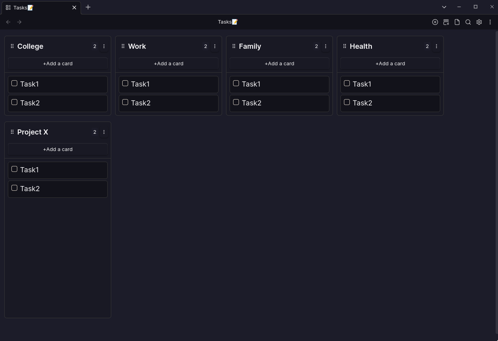
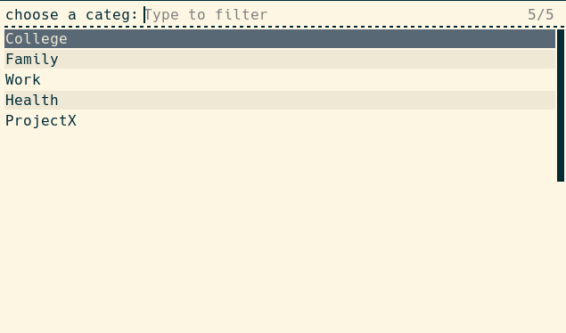
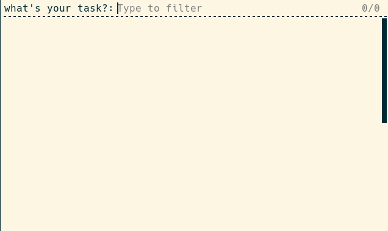
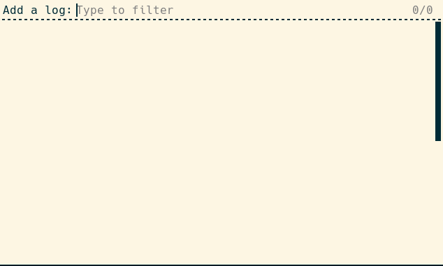
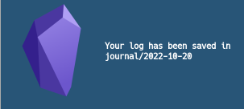

Every now and then i think of something small that would be nice to add to my obsidian workflow. Usually it's a couple of minutes before I find out about another cool plugin that does the thing i wanted and that's why community plugins are one of the great things in obsidian.

But sometimes I want something tailored to me and my workflow.

The idea that my vault is just some local plain text files. This means that i don't need to know typescript or to dive deep into the API docs to implement the small things I wanted.

I figured out that i can do many of the ideas i have with just some basic bash script and one or two cli tools.

so here's some examples of bash scripts i use daily in my obsidian workflow.

## How i manage tasks in obsidian

- I like to organize and group my tasks by categories(Areas of life).
- And I want to see an overview of all of my tasks in every aspect of my live in one place. I've tried many ways to achieve this in obsidian but none worked for me
- My tasks now look something like this

  

- And I made some tweaks to the kanban plugin original layout to have lists so it's in rows and columns.

- If I was working on something outside of obsidian like in the browser and I wanted to quickly add a task,I needed to go through the process of opening obsidian, waiting for it to open, opening the tasks📝 note and putting my to-do under one of those headings. This is a painful process to go through every time i needed to do something so simple like adding a to-do.

But Now the process goes something like this.

1. I press `super+n+t` anywhere a rofi window pops up

   

2. choose college for example.Another rofi window pops up

   

3. After writing the task it's added under the College heading in my tasks📝 note and a notification pops up to confirm that.

   

- The task is added in this format - [ ] #task #college{task}
- Now i have all my tasks in one place , i add tasks quickly and i can use either the tasks or the dataview plugin to add another layer of organization to my tasks.

---

## Adding a log to my daily note

- I like to keep track of what i do through the day

1. I press `super + n + l` , a rofi window pups up

   

2. The log is added to daily note under the ## Logs heading in this format - hh:mm {log} and a notification pops up

   

---

There are others things I do with bash. functions like quick-capture,quick-append,search-query,open

---

my `sxhkd` cofig:

```
super + n ; {t,c,l,s,a}
  ~/scripts/obsidian_rofi {quick-task,quick-capture,quick-log,search-query,append}
```

---

my kanban css

```css
.kanban-plugin__board > div {
  flex-wrap: wrap;
  align-items: stretch;
}
.kanban-plugin__scroll-container.kanban-plugin__horizontal {
  overflow-y: auto;
}
.kanban-plugin__lane {
  max-height: 500px;
}
.kanban-plugin__lane-wrapper {
  margin-bottom: 15px;
}
```
